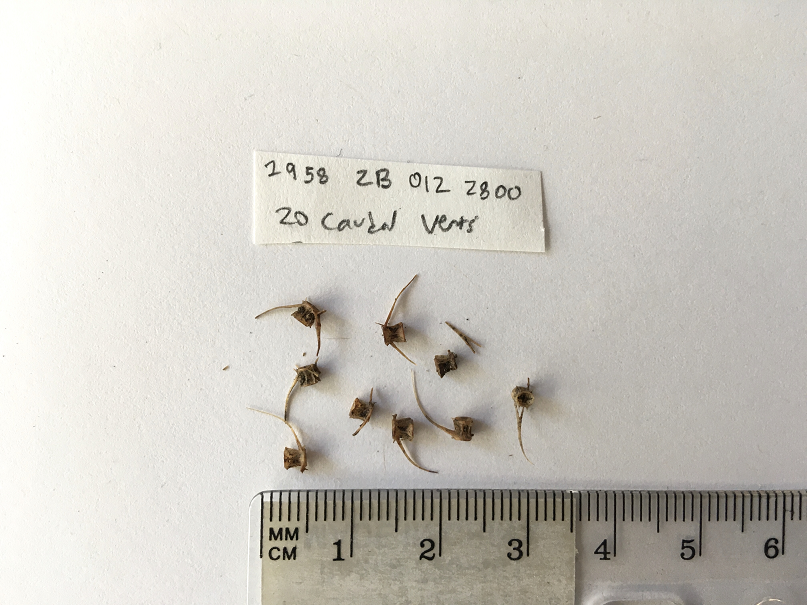

# Ancient_DNA_Herring_TaqMan
Scripts used for manuscript

# Hybridization capture of ancient DNA 

This repository contains the scripts that were used in the manuscript *"Ancient DNA reveals phenological diversity of Coast Salish herring harvests over multiple centuries"*.

## Study Summary

In this study, we investigated the relative contributions of genetically and phenologically distinct herring populations to Indigenous Peoples’ food systems over multiple centuries, using ancient DNA extracted from archaeological herring bones. Using genetic stock identification from seven nuclear DNA markers, we showed that catches at the two sites in central Puget Sound were dominated by January-February and March-April spawners, which are the contemporary spawning groups in the vicinity of the sites.

## Directory structure
`scripts` : Contains R Scripts used to analyze data

